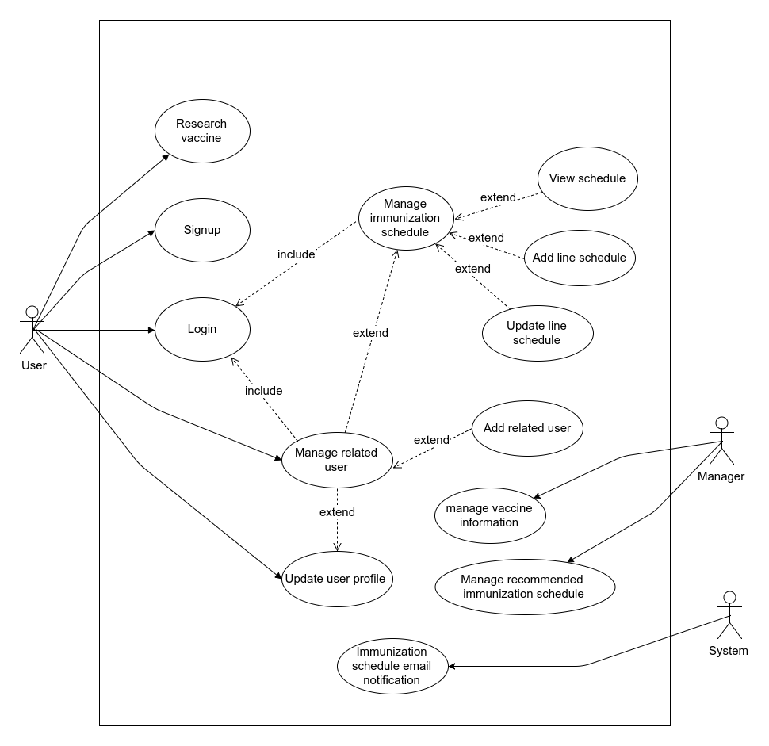
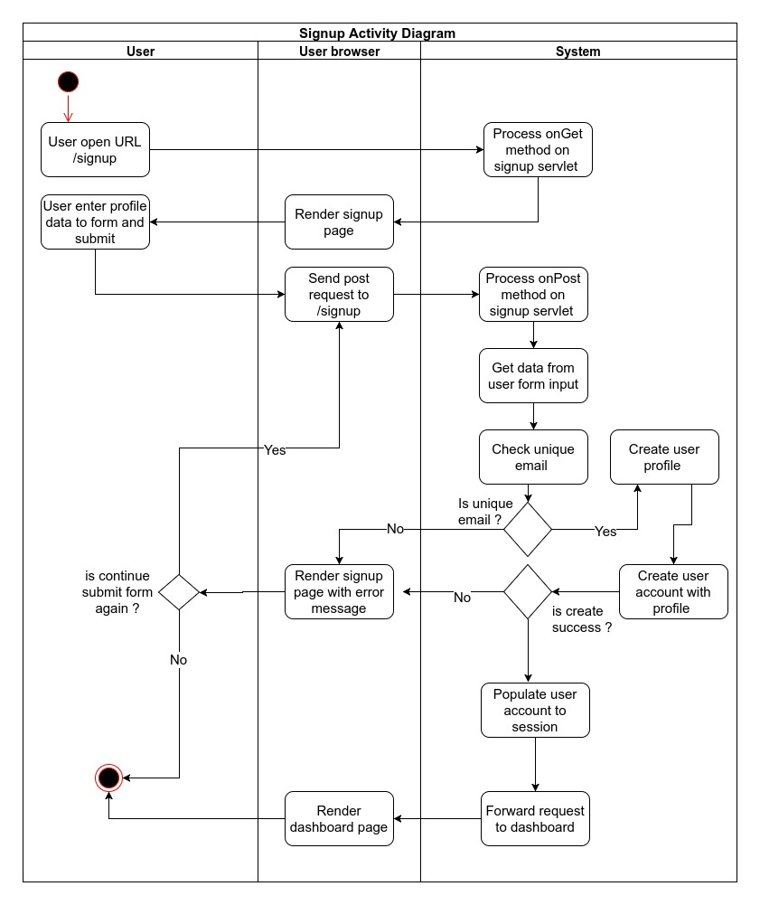
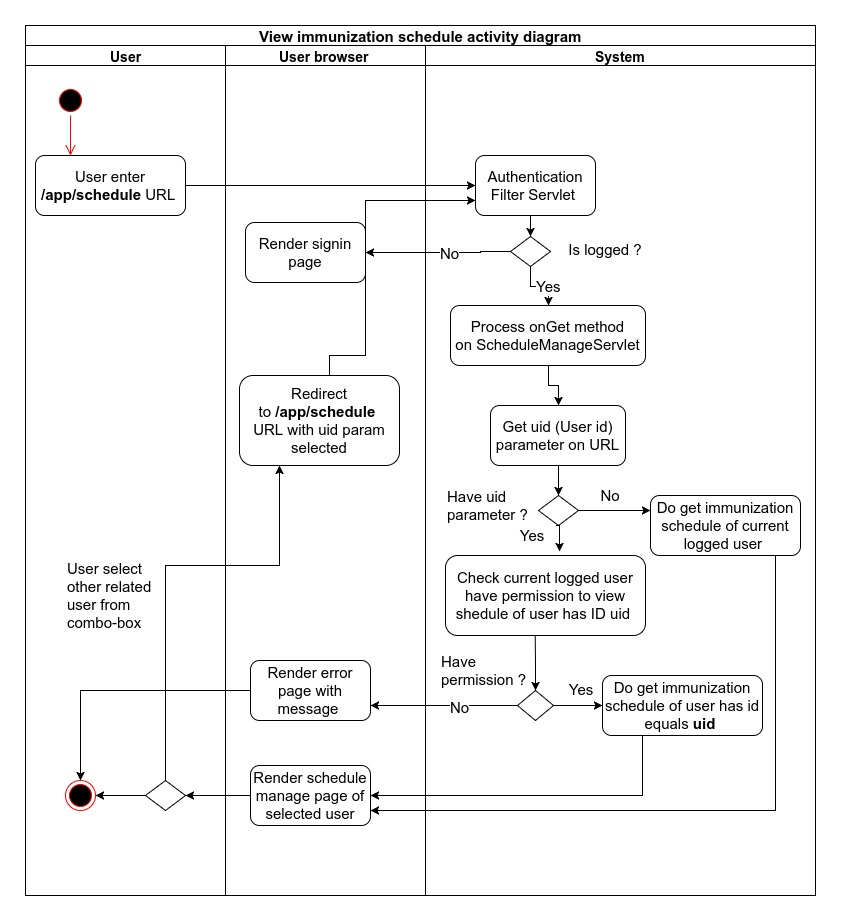
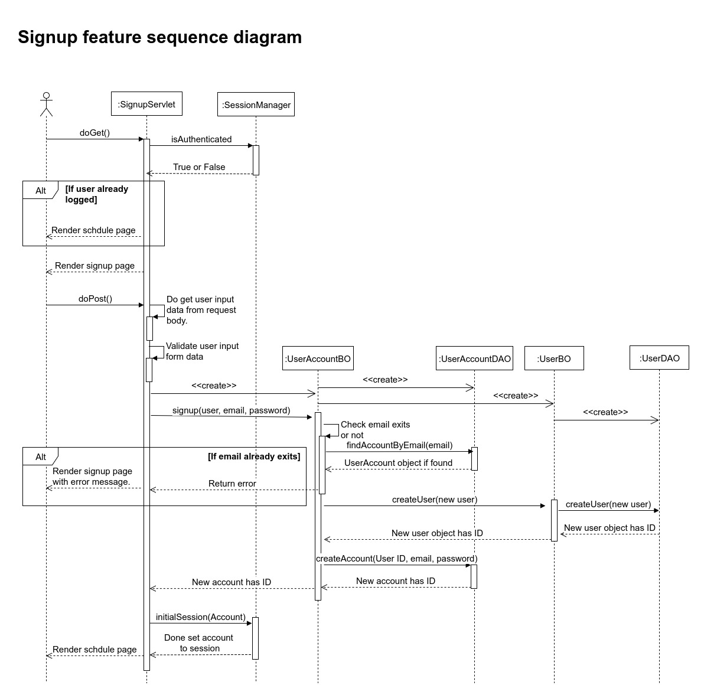
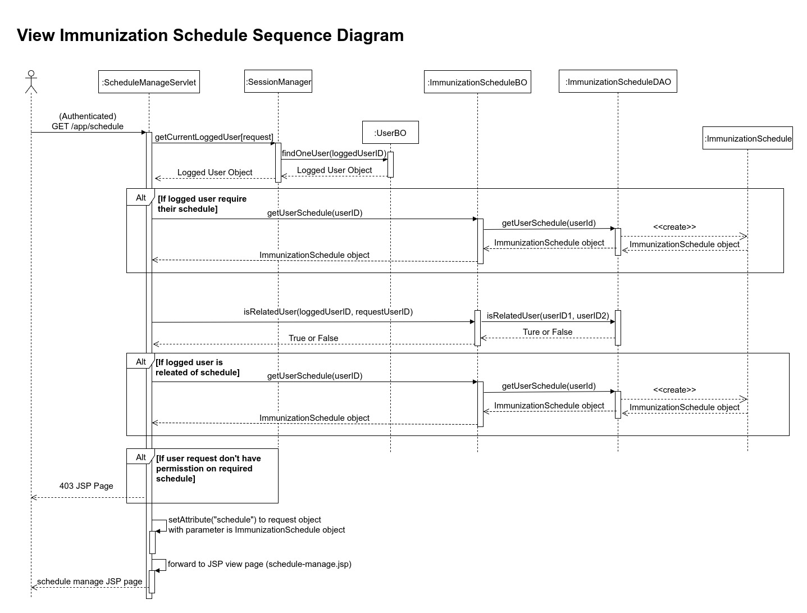
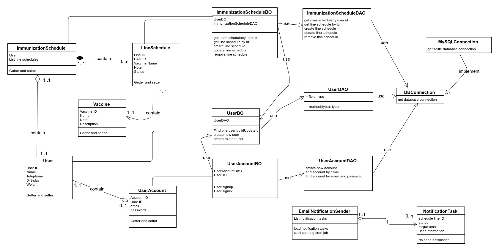
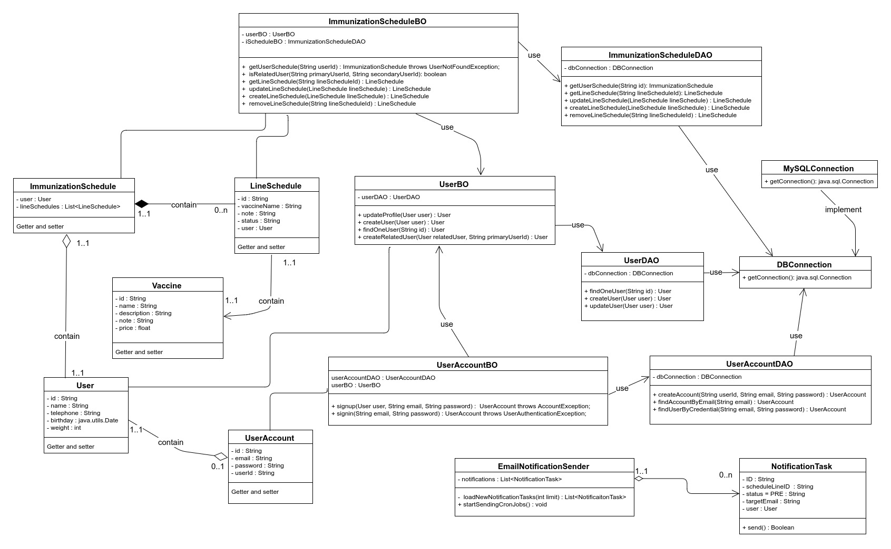
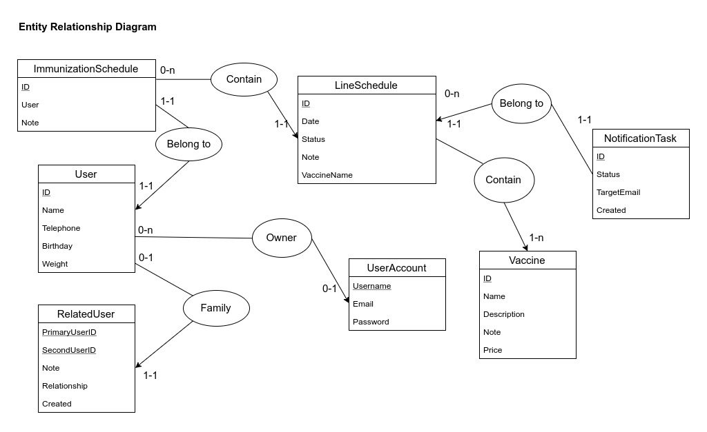
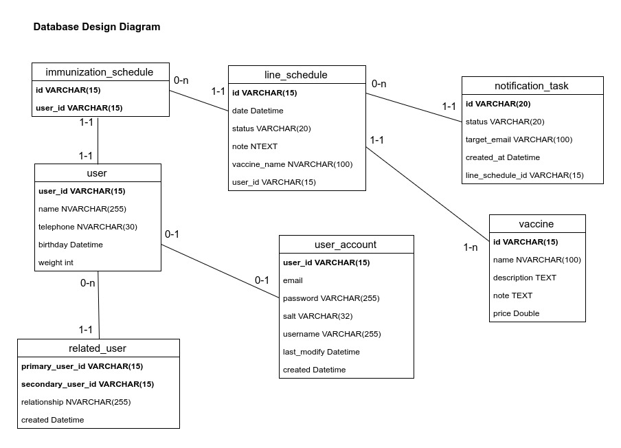

# Đề tài

Ứng dụng hỗ trợ ngươi dùng quản lý phác đồ tiêm chủng cá nhân.

# Phạm vi 

**Đề tài SE10**: Xây dựng hệ thống quản lý tiêm chủng Vaccine cho trung tâm y tế dự phòng.

Tuy nhiên nhóm chỉ làm một phần trong dự án trên. Đó là phần ứng dụng hỗ trợ ngươi dùng quản lý phác đồ tiêm chủng cá nhân.

# Đối tượng hệ thống

Các đối tượng có trong hệ thống (theo góc nhìn người lập trình) bao gồm:

1) Người dùng 
2) Vaccine (Thuốc tiêm)
3) Phác đồ 
4) Tài khoản 
5) Nhân thân 

# Tính năng của ứng dụng 

1) Tạo tài khoản và đăng nhập.
2) Tra cứu thông tin thuốc.
3) Xem phác đồ.
4) Quản lý phác đồ. 
5) Quản lý nhân thân.
6) Người dùng cập nhật thông tin cá nhân.
7) Nhắc nhở lịch tiêm chủng.
8) Tham khảo phác đồ tiêm chủng.  

# Đặc tả yêu cầu 

## 1. Tạo tài khoản và đăng nhập 

### Mô tả 

Tính năng này cho phép người dùng tạo tài khoản cá nhân của mình với các dữ liệu là tên tài khoản, địa chỉ email và mật khẩu. Mục đích là để người dùng sử dụng tài khoản này để đăng nhập vào hệ thống và quản lý phác đồ của mình.

### Yêu cầu chức năng 

Yêu cầu thông tin tài khoản cho mỗi người dùng là duy nhất. Địa chỉ email và tài khoản là duy nhất không được trùng lặp.Người dùng có thể đăng nhập bằng tên tài khoản hoặc địa chỉ email đã đăng ký với mật khẩu của mình. 

**Các thông tin yêu cầu cho mỗi tài khoản bao gồm:**

1) Họ và tên
2) Ngày tháng năm sinh
3) Số điện thoại (tuỳ chọn)
4) Địa chỉ email 
5) Cân nặng
6) Mật khẩu 
7) Tên đăng nhập 

## 2. Tra cứu thông tin thuốc  

### Mô tả 

Tính năng này cho phép người dùng nhập từ khóa tên thuốc và hệ thống sẽ truy vấn và trả về các loại vaccine có tên chứa từ khóa đó. Tra cứu thông tin thuốc giúp người dùng biết về giá bán, chỉ định và các lưu ý khi tiêm thuốc. Qua đó giúp người dùng có được những thông tin cần thiết để quyết định tiêm hay không tiêm loại thuốc ấy.

### Yêu cầu chức năng 

**Các thông tin cần có cho mỗi loại vaccine bao gồm**

1) Tên vaccine 
2) Giá bán 
3) Chỉ định và chống chỉ định 
4) Lưu ý 

## 3. Xem phác đồ

### Mô tả 

Tính năng này cho phép người dùng xem được phác đồ tiêm chủng của mình hoặc của nhân thân mình. Các thông tin trong phác đồ cho người dùng biết lịch trình tiêm chủng các nhân của mình, những loại vaccine đã tiêm, chưa tiêm hoặc đã quá hạn tiêm. Từ những thông tin trong phác đồ đó người dùng sẽ có những quyết định tiêm chủng phù hợp.

### Yêu cầu chức năng 

**Các thông tin cần hiển thị trong phác đồ**

1) Tên người được tiêm
2) Tên vaccine 
3) Ngày tiêm 
4) Lần tiêm
5) Tình trạng tiêm (Đã tiêm, chưa tiêm, quá hạn)

## 4. Quản lý phác đồ

### Mô tả 

Tính năng này cho phép người dùng cập nhật lại lịch trình tiêm chủng của mình, bao gồm các chức năng sau 

**1) Thêm mới một mũi tiêm**

Người dùng sẽ chọn loại thuốc và đặt thời gian cần tiêm.

**2) Cập nhật trạng thái mũi tiêm** 

Người dùng sẽ xác định lại trạng thái mũi tiêm này đã tiêm hay chưa hoặc thay đổi lại ngày tiêm. 

### Yêu cầu chức năng 

1) Việc xác định mũi tiêm bị quá hạn được làm bởi hệ thống.
2) Cho phép người dùng thêm các mũi tiêm trong quá khứ và thiết lập trạng thái cho nó ngay như là đã hoàn thành hoặc đã bị trễ hẹn. Mục đích là để người dùng lưu trữ được lịch tiêm trong quá khứ của mình để tiện tra cứu về sau.

## 5. Quản lý nhân thân

### Mô tả 

Tính năng này cho phép người dùng tạo thêm một phác đồ cho người thân của mình trong gia đình. Mục đích để có thể dễ dàng quản lý lịch trình tiêm chủng của nhiều người thân trong một tài khoản duy nhất, giúp thuận tiện hơn cho người sử dụng.

Thông tin của nhân thân mới, được tạo ra bởi người dùng chính, giống với các thông tin được yêu cầu trong phần thông tin người dùng **tuy nhiên không yêu cầu thông tin tài khoản như tên đăng nhập và mật khẩu**. 

### Yêu cầu chức năng 

**1. Khi tạo mới một nhân thân, người dùng phải nhập đủ các thông tin yêu cầu sau đây.** 

1) Họ và tên
2) Ngày tháng năm sinh
3) Số điện thoại (tuỳ chọn)
4) Địa chỉ email (tuỳ chọn)
5) Cân nặng

Trong đó địa chỉ email là tuy chọn, nếu có thì khi nhắc nhở hệ thống sẽ gửi về cho cả người dùng chính và các nhân thân, nếu không hệ thống sẽ gửi lời nhắc về email của người dùng chính.

**2. Nhân thân mới được tạo sẽ có phác đồ riêng của mình.**

Sau khi người dùng tạo thành công nhân thân thành công thì người dùng chính có thể quản lý phác đồ của nhân thân này.

Các nghiệp vụ quản lý phác đồ đã đề cập ở trên.

## 6. Người dùng cập nhật thông tin cá nhân

### Mô tả 

Tính năng này cho phép người dùng cập nhật lại các thông tin liên hệ của mình như số điện thoại hoặc địa chỉ email để có thể nhận được lời nhắc hoặc các thông tin từ ứng dụng.

### Yêu cầu chức năng 

1) Có lưu trữ lại các thông tin cũ trước khi thay đổi, để phòng việc tài khoản người dùng bị kẻ xấu lợi dụng.

2) Nếu thay đổi địa chỉ email thì sẽ có một thông báo đổi địa chỉ email về email cũ. Việc này phòng ngừa việc kẻ xấu cố ý đổi địa chỉ email để chiếm tài khoản qua cơ chế phục hồi mật khẩu.

## 7. Nhắc nhở lịch tiêm chủng

### Mô tả 

Tính này cho phép hệ thống gửi một email cho người dùng để nhắc nhở khi đến gần thời gian tiêm.

### Yêu cầu chức năng 

Email sẽ được gửi đến tại hai thời điểm:

1) 15 ngày trước khi tiêm.
2) 5 ngày trước khi tiêm.
2) 1 ngày trước khi tiêm.

## 8. Tham khảo phác đồ tiêm chủng

### Mô tả 

Tính này cho phép người dùng tra cứu một số phác đồ tiêm chủng chuẩn đã được chỉ định bởi bộ y tế dành riêng cho các loại đối tượng hoặc một loại bệnh lý cụ thể nào đó.

### Yêu cầu chức năng 

Dữ liệu cho tính năng này chỉ được nhập bởi cán bộ quản lý và được kiểm duyệt chặt chẽ về nội dung.

# Thiết kế giao diện 

Hệ thống này xây dựng trên nền tảng website và gồm các màn hình chính sau.

1) Trang chủ. 
2) Trang đăng nhập.
3) Trang đăng ký tài khoản.
4) Trang quản lý phác đồ.
5) Trang cập nhật thông tin cá nhân của người dùng.

# Mô hình hóa 

## Sơ đồ use case 

Từ đặc tả yêu cầu nhận được từ giảng viên hướng dẫn, chúng em xây dựng lên sơ đồ use case như dưới đây.

## Đặc tả chi tiết sơ đồ use case 

### 1. Research vaccine (tìm kiếm vắc-xin)
---

#### 1.1 Mô tả 

Tính năng này cho phép người dùng tìm kiếm vắc-xin theo theo tên.

#### 1.2 Tác nhân 

+ Người dùng (User)

#### 1.3 Luồng nghiệp vụ 

1) Người dùng nhập tên thuốc vào ô tìm kiếm và nhấn nút tìm. 
2) Hệ thống nhận chuỗi kiểm và lọc các ký tự nhạy cảm để tránh bị tấn công bảo mật.
3) Tiến hành truy vấn vào cơ sở dữ liệu để tìm thuốc theo tên.
4) Kết quả trả về được hiển thị trên trang "kết quả tìm kiếm" riêng biệt.

#### 1.4 Yêu cầu nghiệp vụ 

1) Kết quả trả về bao gồm tên thuốc, công dụng, giá tham khảo và các lưu ý.
2) Kết quả trình bày theo dạng phân trang, mỗi trang gồm 30 phần tử.
3) Tính năng này không yêu cầu đăng nhập.

### 2. Signup (Đăng ký tài khoản)
----

#### 1.1 Mô tả 

Tính năng này cho phép người dùng tạo mới tải khoản để sử dụng ứng dụng.

#### 1.2 Tác nhân 

+ Người dùng (User)

#### 1.3 Luồng nghiệp vụ 

1) Người dùng nhấp vào nút "Đăng ký" trên giao diện.
2) Hệ thống kiểm tra phiên đăng nhập hiện tại, nếu có thì chuyển đến trang "quản lý phác đồ" nếu chưa đăng nhập thì hiển thị trang "Đăng ký tài khoản mới".
3) Người dùng điền đầy đủ thông tin vào biểu mẫu và gửi đi.
4) Hệ thống nhận thông tin gửi đến từ biểu mẫu và tiến hành kiểm tra hợp thức hóa dữ liệu (validation). Tại bước này kiểm tra không trùng lặp địa chỉ thư điện tử (email).
5) Nếu có lỗi xảy ra thì hiển thị trở lại trang "Đăng ký tài khoản mới" kèm theo đó là hiển thị tin nhắn thông báo lỗi gì đã xảy ra (error messages).
6) Tiến hành tạo hồ sơ người dùng (profile) và tài khoản đăng nhập (account).
7) Sau khi tạo tài khoản thành công thì tiến hành tự động đăng nhập vào ứng dụng và chuyển đến trang "quản lý phác đồ".

#### 1.4 Yêu cầu nghiệp vụ 

1) Địa chỉ thư điện tử là duy nhất.
2) Thông tin địa chỉ thư điện tử, mật khẩu, họ tên, năm sinh, cân nặng là bắt buộc.
3) Mật khẩu phải dài hơn 6 ký tự.

### 3. Login (Đăng nhập)
----

#### 1.1 Mô tả 

Tính năng này cho phép người dùng đăng nhập vào hệ thống.

#### 1.2 Tác nhân 

+ Người dùng (User)

#### 1.3 Luồng nghiệp vụ 

1) Người dùng nhấp vào nút "Đăng nhập" trên giao diện.
2) Hệ thống kiểm tra phiên đăng nhập hiện tại, nếu có thì chuyển đến trang "quản lý phác đồ" nếu chưa đăng nhập thì hiển thị trang "Đăng nhập".
3) Người dùng điền đầy đủ thông tin vào biểu mẫu và gửi đi.
4) Hệ thống nhận thông tin gửi đến từ biểu mẫu và tiến hành kiểm tra hợp thức hóa dữ liệu (validation).
5) Nếu có lỗi xảy ra thì hiển thị trở lại trang "Đăng nhập" kèm theo đó là hiển thị tin nhắn thông báo lỗi gì đã xảy ra (error messages).
6) Tiến hành truy vấn vào cơ sở dữ liệu để so khớp địa chỉ thư điện tử (email) và mật khẩu.
7) Nếu mật khẩu và email trùng khớp thì đăng nhập thành công, hệ thống tự động lưu thông tin đăng nhập vào session và gửi về cookie của trình duyệt người dùng để duy trì đăng nhập nhập.
8) Chuyển đến trang "quản lý phác đồ".

#### 1.4 Yêu cầu nghiệp vụ 

1) Đăng nhập bằng đja chỉ thư điện tử và mật khẩu.
2) Nếu nhập sai liên tục trên 15 lần trong 1 giờ thì phải yêu cầu nhập capcha.

### 4. Immunization schedule manage - View schedule (Xem phác đồ tiêm chủng)
----

#### 1.1 Mô tả 

Tính năng này cho phép người dùng xem phác đồ tiêm chủng của mình và người thân.

#### 1.2 Tác nhân 

+ Người dùng (User)

#### 1.3 Luồng nghiệp vụ 

1) Người dùng truy cập vào trang quản lý phác đồ với đường dẫn /app/schedule?id=user_id để xem phát đồ của người dùng có ID là user_id. Trong trường hợp nếu user_id không có trên URL thì mặc định sẽ lấy ID của người dùng đăng nhập hiện tại.

2) Nếu user_id trùng khớp với ID của người dùng đang đăng nhập thì hệ thống sẽ truy vấn vào cơ sở dữ liệu và lấy ra phác đồ của người dùng. Nếu user_id khác với ID của người dùng đang đăng nhập hiện tại thì hệ thống sẽ kiểm tra xem người dùng đang đăng nhập hiện tại có quyền xem phác đồ của người dùng có ID là user_id hay không, dựa trên quan hệ nhân thân. Nếu xác nhận là nhân thân thì sẽ truy vấn vào cơ sở dữ liệu và trả về phác đồ của người dùng đó.

3) Nếu người dùng không được phép xem dữ liệu phác đồ thì sẽ trả về trang báo lỗi (403) kèm theo tin nhắn thông báo lý do.

#### 1.4 Yêu cầu nghiệp vụ 

1) Mỗi người dùng chỉ được phép xem phác đồ của chính mình và của tài khoản nhân thân do mình tạo ra.

### 5. Immunization schedule manage - Add line schedule (Tạo mới lịch tiêm chủng)
----

#### 1.1 Mô tả 

Tính năng này cho phép người dùng tạo mới một lịch tiêm chủng vắc-xin cho mình hoặc nhân thân do mình quản lý.

#### 1.2 Tác nhân 

+ Người dùng (User)

#### 1.3 Luồng nghiệp vụ 

1) Tại trang quản lý phác đồ người dùng nhấn nút "thêm lịch" hệ thống sẽ hiển thị ra một popup trong đó chứa biểu mẫu nhập thông tin lịch.

2) Sau khi nhập xong người dùng gửi biểu mẫu, hệ thống sẽ tiếp nhận biểu mẫu lấy thông tin và tiến hành tạo mới lịch tiêm chủng.

3) Sau khi tạo mới lịch tiêm thành công thì hệ thống sẽ cập nhật lại giao diện và lịch tiêm mới thêm vào sẽ xuất hiện trên màn hình.

#### 1.4 Yêu cầu nghiệp vụ 

1) Thông tin ngày tiêm và tên vắc-xin là bắt buộc.
2) Tính năng này yêu cầu đăng nhập.
3) Người dùng chỉ có thể tạo lịch tiêm cho chính mình hoặc nhân thân do mình quản lý. 

### 6. Immunization schedule manage - Update line schedule (cập nhật lịch tiêm chủng đã có)
----

#### 1.1 Mô tả 

Tính năng này cho phép người dùng tạo cập nhật lại một lịch tiêm chủng vắc-xin cho mình hoặc nhân thân do mình quản lý.

#### 1.2 Tác nhân 

+ Người dùng (User)

#### 1.3 Luồng nghiệp vụ 

1) Tại trang quản lý phác đồ người dùng nhấn nút "cập nhật" ở trên mỗi dòng phác đồ. Hệ thống sẽ hiển thị ra một popup trong đó chứa biểu mẫu nhập thông tin lịch.

2) Sau khi nhập xong người dùng gửi biểu mẫu, hệ thống sẽ tiếp nhận biểu mẫu lấy thông tin và tiến hành cập nhật lịch tiêm chủng.

3) Sau khi cập nhật lịch tiêm thành công thì hệ thống sẽ cập nhật lại giao diện và lịch tiêm mới thêm vào sẽ xuất hiện trên màn hình.

#### 1.4 Yêu cầu nghiệp vụ 

1) Thông tin ngày tiêm và tên vắc-xin là bắt buộc.
2) Tính năng này yêu cầu đăng nhập.
3) Người dùng chỉ có thể tạo lịch tiêm cho chính mình hoặc nhân thân do mình quản lý. 

### 7. Manage related user - Add related user (Thêm mới nhân thân)
----

#### 1.1 Mô tả 

Tính năng này cho phép người dùng tạo thêm hồ sơ nhân thân của mình để có thể quản lý nhiều phác đồ tiêm chủng của người thân khác nhau trong cùng một tài khoản. 

#### 1.2 Tác nhân 

+ Người dùng (User)

#### 1.3 Luồng nghiệp vụ 

1) Tại trang quản lý phác đồ người dùng nhấn nút "thêm nhân thân". Hệ thống sẽ hiển thị ra một popup trong đó chứa biểu mẫu nhập thông tin nhân thân.

2) Sau khi nhập xong người dùng gửi biểu mẫu, hệ thống sẽ tiếp nhận biểu mẫu lấy thông tin và tiến hành tạo mới hồ sơ người dùng cho nhân thân mới này.

3) Sau khi tạo thành công nhân thân mới, thì hệ thống sẽ chuyển sang trang phác đồ của nhân thân mới được tạo.

#### 1.4 Yêu cầu nghiệp vụ 

1) Thông tin về họ tên, cân nặng và năm sinh là bắt buộc.
2) Nhân thân không yêu cầu tài khoản.
3) Tính năng này yêu cầu đăng nhập.

### 8. Manage vaccine information (Quản lý thông tin vắc-xin)
----

#### 1.1 Mô tả 

Tính năng này cho phép người quản lý có thể tạo mới vắc-xin hoặc cập nhật lại thông tin vắc-xin. Thông tin vắc-xin cung cấp cho người dùng dữ liệu để tra cứu và tham khảo.

#### 1.2 Tác nhân 

+ Người quản lý (Manager)

#### 1.3 Luồng nghiệp vụ 

1) Tại màn hình quản lý, người quản lý nhấp vào nút "thêm mới" hoặc nút "chỉnh sửa" trên mỗi dòng bảng dữ liệu để thêm hoặc cập nhật lại một vắc-xin. 

2) Sau khi nhập xong người dùng gửi biểu mẫu, hệ thống sẽ tiếp nhận biểu mẫu lấy thông tin và tiến hành xác thực quyền quản lý và tạo mới hoặc cập nhật vắc-xin.

3) Sau khi tạo hoặc cập nhật thành công thì hệ thống sẽ cập nhật lại dữ liệu trên giao diện.

#### 1.4 Yêu cầu nghiệp vụ 

1) Tính năng này yêu cầu đăng nhập.
2) Tính năng này yêu cầu tài khoản có quyền quản lý.
3) Thông tin tài khoản đăng nhập cho quản lý được lưu trữ ở bảng dữ liệu riêng biệt với tài khoản người dùng để bảo đảm về bảo mật và phân quyền.

### 9. Manage recommended immunization schedule (Quản lý phác đồ tiêm chủng tham khảo)
----

#### 1.1 Mô tả 

Tính năng này cho phép người quản lý có thể tạo một bài viết để giới thiệu về một lịch trình tiêm chủng tiêu chuẩn cho người dùng.

#### 1.2 Tác nhân 

+ Người quản lý (Manager)

#### 1.3 Luồng nghiệp vụ 

1) Tại màn hình quản lý phác đồ tiêu chuẩn, người quản lý nhấp vào nút "thêm mới" hoặc nút "chỉnh sửa" trên mỗi dòng bảng dữ liệu để thêm hoặc cập nhật lại một phác đồ.

2) Sau khi nhập xong người dùng gửi biểu mẫu, hệ thống sẽ tiếp nhận biểu mẫu lấy thông tin và tiến hành xác thực quyền quản lý và tạo mới hoặc cập nhật phác đồ.

3) Sau khi tạo hoặc cập nhật thành công thì hệ thống sẽ cập nhật lại dữ liệu trên giao diện.

#### 1.4 Yêu cầu nghiệp vụ 

1) Tính năng này yêu cầu đăng nhập.
2) Tính năng này yêu cầu tài khoản có quyền quản lý.
3) Thông tin tài khoản đăng nhập cho quản lý được lưu trữ ở bảng dữ liệu riêng biệt với tài khoản người dùng để bảo đảm về bảo mật và phân quyền.

### 10. Immunization schedule email notification (Thông báo lịch tiêm chủng qua thư điện tử)
----

#### 1.1 Mô tả 

Tính năng này cho phép hệ thống tự động gửi email đến cho người dùng khi một lịch tiêm sắp đến hạn.

#### 1.2 Tác nhân 

+ Hệ thống (System)

#### 1.3 Luồng nghiệp vụ 

1) Hệ thống tự động chạy vào mỗi 7h sáng mỗi ngày để kiểm tra toàn bộ lịch tiêm chủng của tất cả người dùng trong hệ thống.

2)Nếu có lịch sắp đến hạn trong phạm vi 15 ngày, 5 ngày và 1 ngày thì sẽ tiến hành gửi email, sau khi gửi hoàn tất thì tiến hành đánh dấu đã gửi để tránh việc gửi trùng email gây phiền nhiễu cho người dùng.

#### 1.4 Yêu cầu nghiệp vụ 

1) Không được gửi thư quá một lần cho mỗi mốc thời gian quy định (15, 5 và 1 ngày).
2) Tính năng này yêu cầu tài khoản có quyền quản lý.
3) Thông tin tài khoản đăng nhập cho quản lý được lưu trữ ở bảng dữ liệu riêng biệt với tài khoản người dùng để bảo đảm về bảo mật và phân quyền.

## Sơ đồ hoạt động (Activity diagram)

### Sơ đồ hoạt động tính năng tạo mới tài khoản 

Dựa theo đặc tả yêu cầu và phân tích đặc tả use case, bọn em vẽ ra sơ đồ hoạt động cho tính năng tạo mới tài khoản như sau.

### Sơ đồ hoạt động tính năng xem phác đồ 

Dựa theo đặc tả yêu cầu và phân tích đặc tả use case, bọn em vẽ ra sơ đồ hoạt động cho tính năng xem phác đồ như sau.

## Sơ đồ tuần tự (Sequence diagram)

### Sơ đồ tuần tự tính năng tạo mới tài khoản 

Dựa theo đặc tả yêu cầu và phân tích đặc tả use case và sơ đồ hoạt động, bọn em vẽ ra sơ đồ hoạt động cho tính năng tạo mới tài khoản như sau.

### Sơ đồ tuần tự tính năng xem phác đồ 

Dựa theo đặc tả yêu cầu và phân tích đặc tả use case và sơ đồ hoạt động, bọn em vẽ ra sơ đồ hoạt động cho tính năng xem phát đồ như sau.

## Sơ đồ lớp 

### Sơ đồ lớp phân tích (Analytic class diagram)

### Sơ đồ lớp thiết kế (Design class diagram)

Thiết kế trên ngôn ngữ lập trình Java.

### Sơ đồ thực thế quan hệ (ERD) 

### Sơ đồ thiết kế cơ sở dữ liệu (Database Design Diagram) 

