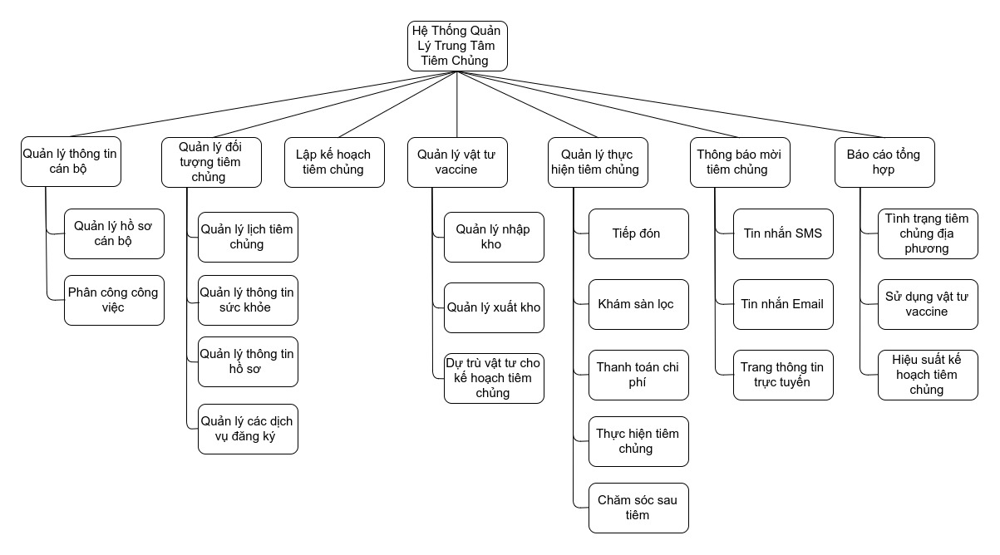
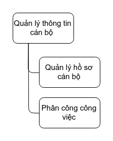
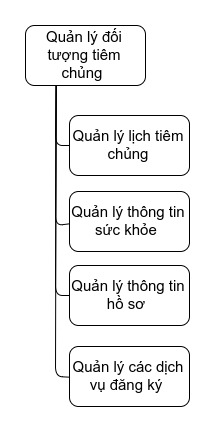
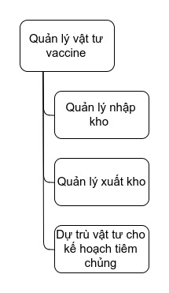
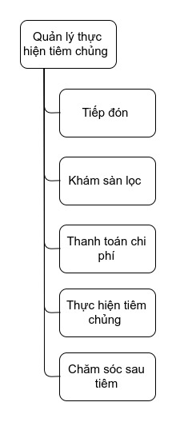
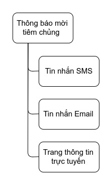
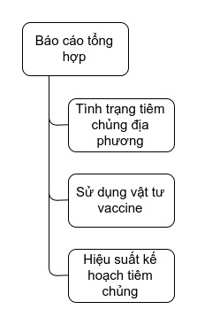

# Thiết kế cấu trúc Slide thuyết trình 

### I. Mở đầu

- Nêu lên thực trạng hiện tại và mong muốn 

### II. Phân tích hiện trạng và xác định yêu cầu 

**1) Nêu lên sơ đồ phân rã chức năng tổng (Cái thực tế cần)**

**Nêu lên phạm vi của đề tài mà nhóm làm **
 + QL đối tượng tiêm chủng 
 + QL Thực hiện tiêm chủng 
 + Hỗ trợ người dùng tra cứu và quản lý lịch tiêm chủng cá nhân 

**2) Phân tích nghiệp vụ tiêm chủng (5 bước)**

Để vào đây sơ đồ DFD ngày xưa và phân tích ra

**3) Phân tích nghiệp vụ quản lý đối tượng**

**4) Nói về hai cái mình làm là**

+ Quản lý lịch tiêm chủng cá nhân 
+ Quản lý thông tin hồ sơ cá nhân 

### III. Phân tích và thiết kế hệ thống 

Nêu lên các sơ đồ quan trọng nhất bao gồm 

1) Use case 
2) Activity tổng (em đang vẽ)
3) Class design diagram (em đang vẽ lại) 
4) Database diagram (em đang vẽ lại) 
5) Thiết kế giao diện 

### IV. Phần demo (nếu có)

----

Thay đổi cho chương I trong báo cáo bằng toàn bộ nội dung bên dưới đây.

# I. GIỚI THIỆU ĐỀ TÀI 

### 1. PHÂN TÍCH HIỆN TRẠNG VÀ XÁC ĐỊNH YÊU CẦU 

Ở Việt Nam hiện nay, các trung tâm tiêm chủng được đặt ở khắp nơi bao gồm cả trung tâm y tế công và cả các trung tâm tiêm chủng dịch vụ.  Với sự phân bổ như thế này cộng với việc quản lý hồ sơ, giấy tờ bằng phương pháp thủ công dẫn đến việc tổng hợp dữ liệu để đưa ra các báo cáo số liệu về tình trạng tiêm chủng địa phương gặp rất nhiều khó khăn. Bên cạnh đó việc quản lý sổ tiêm chủng chỉ bằng sổ giấy làm cho việc xác định các mũi tiêm gặp nhiều khó khăn vi sai sót, mất sổ, bỏ sót gây nguy hiểm cho người tiêm chủng.

Để giải quyết được thực trạng trên, cần có một nền tảng công nghệ thông thống nhất và xuyên suốt cho tất cả các trung tâm tiêm chủng để dữ liệu được đồng bộ với nhau. Bên cạnh đó cũng cần có một nghiệp vụ thống nhất và hệ thống luật định rõ ràng.

Dự án tiêm chủng mở rộng Quốc gia đã ban hành văn bản "Quy trình Chỉ định tiêm vắc xin và Tư vấn trước tiêm chủng trong tiêm chủng mở rộng". Quy trình ban hành kèm theo quyết định số 678/QĐ-VSDTTƯ ngày 07 tháng 06 năm 2013 của Viện trưởng Viện Vệ sinh Dịch tễ Trung ương, Chủ nhiệm Dự án tiêm chủng mở rộng Quốc gia. Nhằm thực hiện chỉ định tiêm vắc xin và tư vấn trước tiêm chủng để đảm bảo an toàn tiêm chủng theo đúng Qui định về sử dụng vắc xin và sinh phẩm y tế trong dự phòng và điều trị (Quyết định số: 23/2008/QĐ-BYT, ngày 07 tháng 07/2008) của Bộ trưởng Bộ Y tế .

Bên cạnh đó các mẫu báo cáo về số liệu cũng đã được chuấn hóa và thống nhất trên tất cả các trung tâm tiêm chủng.

Từ cơ sở trên, nhóm chúng em đề xuất tạo ra một phần mềm đáp ứng ba yêu cầu sau.

**a) Tổng hợp và tập trung thông tin**
 
 Xây dựng một phần mềm mà tất cả các trung tâm y tế đều có thể sử dụng, việc này giúp cho việc đồng bộ thông tin dễ dàng hơn. Kéo theo đó việc tra cứu thông tin từ một nguồn dữ liệu chung sẽ giúp thuận tiện cho người bệnh và là cơ sở cho việc tư vấn và điều trị cho y bác sĩ.
 
 
 **b) Chuyên môn hóa**
 
 Xây dựng một phần mềm có tính chuyên môn hóa cho nghiệp vụ tiêm chủng, dựa trên quy trình tiêm chủng đã được bộ y tế ban hành. Việc này sẽ giúp cho các thao tác nghiệp vụ tại trung tâm y tế trở nên xuyên suốt và đồng bộ, tránh được các sai sót.
 
 **c) Tương tác hai chiều**
 
 Tương tác hai chiều giữa trung tâm y tế và đối tượng tiêm chủng, đây là tiêu chí quan trọng nhất. Vì nguồn dữ liệu về lịch trình tiêm chủng hiện còn tồn đọng trên sổ giấy và phân tán rất nhiều, việc chỉ đồng bộ một chiều từ trung tâm tiêm chủng đến đối tượng tiêm chủng là không đủ. Việc tiếp nhận dữ liệu cả theo chiều ngược lại là vô cùng cần thiết, tuy nhiên đây cũng là vấn đề cần đặc biệt lưu ý vì dữ liệu có thể sai sót nên cần có cơ chế để kiểm tra và đối sánh phù hợp.
 
 
### 2. TÌM HIỂU, PHÂN TÍCH YÊU CẦU NGHIỆP VỤ 

Sau khi xác định thực trạng và đặt ra các mục tiêu, nhóm chúng em tiến hành bước điều tra và phân tích nghiệp vụ và các yêu cầu thực tế để giải quyết bài toán quản lý tiêm chủng cho trung tâm y tế dự phòng.

Nguồn thông tin mà bọn em tìm được là từ việc hỏi các bạn và người thân làm việc trong nghành y tế, các văn bản ban hành của bộ y tế, trang thông tin tiêm chủng quốc gia và hàng loạt các bài báo và bài viết trên mạng.

Qua quá trình phân tích thì bọn em xây dựng được sơ đồ phân rã chức năng như sau.

 
 Hình 2.1 - Sơ đồ phân rã chức năng của hệ thống quản lý trung tâm y tế dự phòng.
 
 
 Qua sơ đồ, thấy rằng bài toán quản lý trung tâm tiêm chủng có thể chia nhỏ thành sáu bài toán bao gồm:
 
+ Quản lý thông tin cán bộ 
+ Quản lý đối tượng tiêm chủng 
+ Lập kế hoạch tiêm chủng 
+ Quản lý vật tư vaccine 
+ Quản lý thực hiện tiêm chủng 
+ Thông báo mời tiêm chủng 
+ Báo cáo tổng hợp 

Đi sâu vào phân tích từng phần để có thể hiểu rõ hơn yêu cầu của từng bài toán.

**2.1 Quản lý thông tin cán bộ**

Hình 2.2.1 - Phân rã chức năng quản lý thông tin cán bộ

Quản lý thông tin các bộ bao gồm hai phần 

**a) Quản lý hồ sơ cán bộ**

Quản lý các thông tin về cán bộ, nơi ở thông tin liên hệ , trình độ chuyên môn.

 **b) Phân công công việc**
 
Trong quy trình tiêm chủng 4 bước chuẩn và nghiệp vụ lập kế hoạch tiêm chủng thì việc phân công lập lịch công tác là vô cùng cần thiết.

**2.2 Quản lý đối tượng tiêm chủng**
 
 
 
 Hình 2.2.1 - Phân rã chức năng quản lý đối tượng tiêm chủng 
 
 Đối tượng tiêm chủng ở đây chính là người tiêm chủng. Bài toán quản lý đối tượng tiêm chủng bao gồm:
 
 **a) Quản lý lịch tiêm chủng**
 
 Quản lý lịch tiêm chủng cá nhân, giúp cho bác sĩ có thể xác định được lịch sử tiêm chủng của đối tượng làm cơ sở để tư vấn và điều trị. Bên cạnh đó lịch tiêm chủng cũng là cơ sở để xác định các mũi tiêm cần thiết trong tương lai. 
 
 Việc quản lý lịch tiêm chủng yêu cầu xác định được loại thuốc cần tiêm, nơi tiêm, cán bộ đã thực hiện tiêm và tình trạng của mũi tiêm đó đã hoàn thành hay bị đình lại vì lý do nào đó.
 
 **b) Quản lý thông tin sức khỏe** 
 
 Quản lý thông tin sức khỏe, thực chất là liên tục lưu lại tình trạng sức khỏe của đối tượng theo từng giai đoạn khác nhau, ví dụ như theo dõi tình trạng cân nặng và chiều cao của em bé từ năm 1 tuổi đến 5 tuổi. Các thông tin này là cơ sở để xác định và dự đoán tình trạng sức khỏe của trẻ ngoài ra các số liệu thống kê về tình trạng sức khỏe còn được sử dụng cho các báo cáo tổng của bộ y tế để giúp xác định tình trạng sức khỏe của Việt Nam.
 
 **c) Quản lý thông tin hồ sơ**
 
 Quản lý các thông tin về đối tượng như là tên, tuổi, ngày tháng năm sinh, giới tính, hộ khẩu, .... Bên cạnh đó đối với trẻ em sơ sinh và người chưa đủ tuổi còn có thêm việc quản lý thông tin nhân thân, người đại diện hợp pháp.
 
 **2.3 Lập kế hoạch tiêm chủng**
 
 Theo mỗi giai đoạn trong năm hoặc khi có bệnh dịch xảy ra, yêu cầu về lập ra một kế hoạch tiêm chủng dự phòng là rất cần thiết. Để lập được ra một kế hoạch tiêm chủng thì rất cần có các số liệu về đối tượng tiêm chủng tại địa phương đó để lên các phương án thông báo, tuyên truyền và dự trù vật tư vaccine.
 
 
 **2.4 Quản lý vật tư vaccine**
 
 
 
  Hình 2.4.1 - Phân rã chức năng quản lý vật tư vaccine
  
 Quản lý vật tư vaccine nhằm xác định số lượng vaccine đang có, tình trạng sử dụng của mỗi loại để từ đó lên kế hoạch nhập thêm hoặc xuất vaccine. Việc quản lý vật tư vaccine bao gồm 
 
 **a) Quản lý nhập vaccine**
 
 Quản lý việc nhập vaccine, thông thường các trung tâm y tế sẽ lập dựa vào các số liệu thông kê về đối tượng tiêm chủng và các kế hoạch tiêm chủng tại địa phương mình để gửi các đề xuất mua hoặc xin cấp vaccine lên bộ y tế.
 
 
  **a) Quản lý xuất vaccine**
 
Quản lý xuất vaccine được chia thành ba loại 

+ **Xuất dùng** là xuất vaccine ra xử dụng trong việc tiêm chủng cho đối tượng.

+ **Xuất trả** là xuất trả lại cho bộ y tế khi không có nhu cầu hoặc một địa phương khác cần dùng loại vaccine đó khẩn cấp.

+ **Xuất hủy** là xuất để hủy bỏ vaccine đã hết hạn hoặc bị hư hỏng do nhiệt độ môi trường hoặc lỗi bảo quản.

**c) Dự trù cho kế hoạch tiêm chủng**

Là việc thông qua các số liệu của địa phương mình, nơi trung tâm tiêm chủng đặt tại để tính toán đưa ra các dự trù về lượng hoặc chủng lại vaccine cần thiết cho để đáp ứng cho các kế hoạch tiêm chủng đặt ra.

**2.5 Quản lý thực hiện tiêm chủng**

Hình 2.5.1 - Phân rã chức năng quản lý thực hiện tiêm chủng

Việc thực hiện tiêm chủng đã được quy định theo công văn của bộ y tế, bao gồm các bước nghiệp vụ sau 

**a) Tiếp đón** 

Là bước đầu tiên trong quy trình, nhàm xác định tên, tuổi, địa chỉ: Nếu chưa có phiếu/sổ tiêm chủng, lập phiếu/sổ tiêm chủng cho trẻ. Ghi tên tuổi địa chỉ vào sổ/ phiếu tiêm chủng cá nhân.

**b) Khám sàn lọc** 

Nhằm hai mục tiêu chính là 

+ Xác định tình trạng sức khỏe hiện tại xem có đủ điều kiện để tiêm chủng không ?

+ Xác định và chỉ định loại vaccine cần tiêm 

**c) Thanh toán chi phí**

Là bước thanh toán các chi phí phục vụ cho việc tiêm chủng.

**d) Thực hiện tiêm chủng** 

Là bước tiến hành tiêm chủng theo đúng chỉ định của bác sĩ ở giao đoạn khám sàn lọc. Tại bước này cũng sẽ cập nhật lại lịch sử tiêm chủng cho đối tượng để quản lý về sau.

**e) Chăm sóc sau tiêm**

Theo quy định, người được tiêm phải ở lại trung tâm ít nhất 30 phút sau tiêm, để kiểm tra và theo dõi tình trạng sức khỏe. Trong trường hợp có biến chứng xảy ra thì phải nhanh chóng khắc phục, ghi lại các thông tin về biến chứng và nhanh chóng triển khai các biện pháp khắc phục.

**2.6 Thông báo mời tiêm chủng**

Hình 2.6.1 - Phân rã chức năng thông báo mời tiêm chủng

Hiện nay hình thức thông báo đang dùng ở các trung tâm y tế là qua tin nhắn SMS. Đây là hình thức rất tiện dụng và nhanh chóng nhất. Ngoài ra các hệ thống mới còn có thêm tính năng thông báo qua thư điện tử (Email) hoặc chia sẽ các kế hoạch lên các trang thông tin điện tử để truyền bá đến nhân dân.

**2.7 Báo cáo tổng hợp**

Hình 2.7.1 - Phân rã chức năng báo cáo tổng hợp

Báo cáo tổng hợp các các trung tâm y tế dự phòng phải liên tục được gửi về cho bộ y tế, tùy theo lại báo cáo mà có chu kỳ khác nhau. 

Trong đó các báo cáo nổi trội nhất là 

+ **Báo cáo về tình trạng tiêm chủng địa phương** cho biết tình trạng tiêm chủng và phòng dịch bệnh của một địa phương, nơi mà trung tâm đó đặt tại, là cơ sở để lập nên các kế hoạch tiêm chủng.

+ **Báo cáo về tình trạng sử dụng vật tư vaccine** Cho biết tình trạng kho chứa vaccine của trung tâm y tế dự phòng đó.

+ **Báo cáo về hiệu suất của các kế hoạch tiêm chủng** cho biết có bao nhiêu người đã được tiêm theo kế hoạch từ đó là cơ sở để tuyên truyền hoặc lập ra các kế hoạch mới.

### 3. XÁC ĐỊNH PHẠM VI ĐỀ TÀI 

Trong đề tài này, bọn em tập trung và tìm hiểu, phân tích và thiết kế ứng dụng để giải quyết ba bài toán đó là

**a) Quản lý đối tượng tiêm chủng**

Bao gồm quản lý hồ sơ cá nhân, lịch tiêm chủng cá nhân và thông tin nhân thân.

**b) Quản lý thực hiện tiêm chủng**

Bao gồm quản lý các bước trong quy trình tiêm chủng tiêu chuẩn bao gồm tiếp đón, khám sàn lọc, thanh toán, thực hiện tiêm và chăm sóc sau tiêm.

**c) Hệ thống hỗ trợ người dùng tra cứu và quản lý lịch tiêm chủng các nhân**
 
 Giúp người dùng ở đây chính là đối tượng tiêm chủng, có thể đăng nhập vào hệ thống, xem và quản lý lịch tiêm chủng cá nhân của mình, đăng ký tiêm chủng và cập nhật hồ sơ cá nhân.
 
 

Từ các bài toán trên xác định ra các tính năng mà phần mềm cần có đó là: 

1) Tạo tài khoản và đăng nhập.
2) Tra cứu thông tin thuốc.
3) Xem lịch tiêm chủng.
4) Quản lý lịch tiêm chủng.
5) Quản lý nhân thân.
6) Tạo và cập nhật hồ sơ đối tượng.
7) Nhắc nhở lịch tiêm chủng.
8) Tham khảo phác đồ tiêm chủng.
9) Quản lý quy trình tiêm chủng 4 bước.

 
 